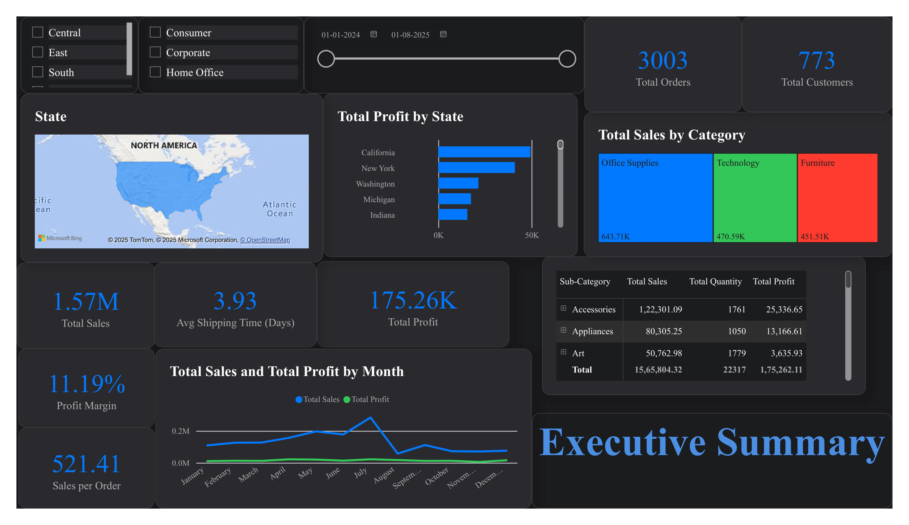
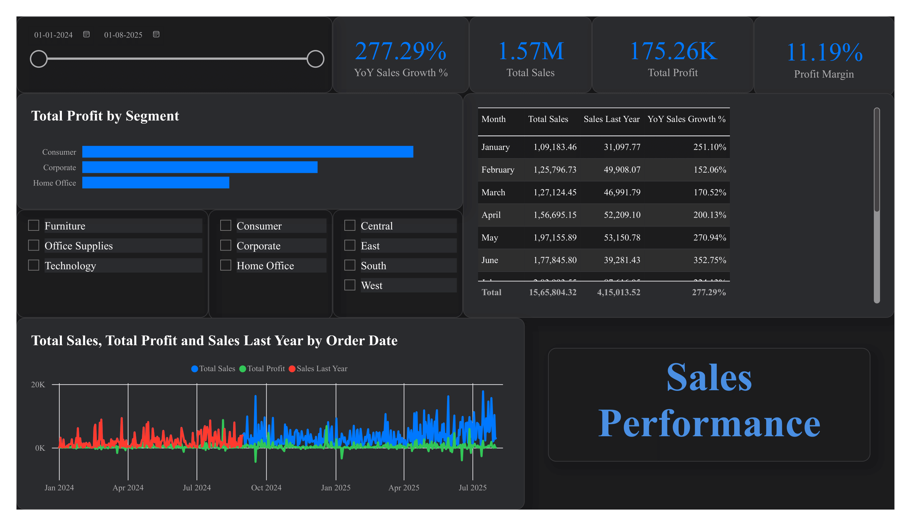
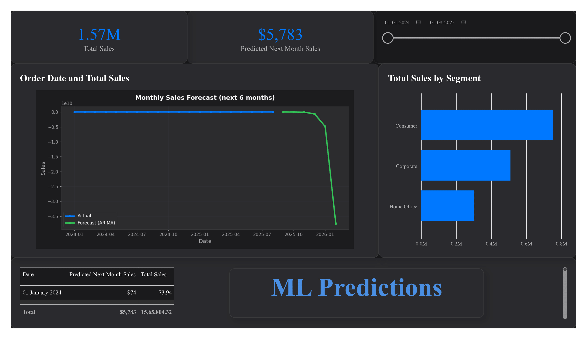
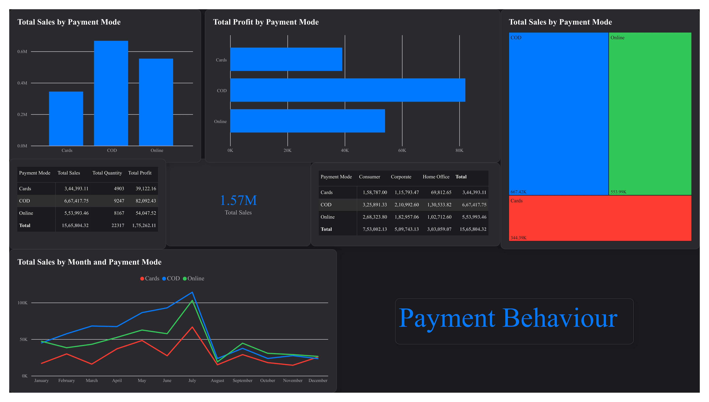
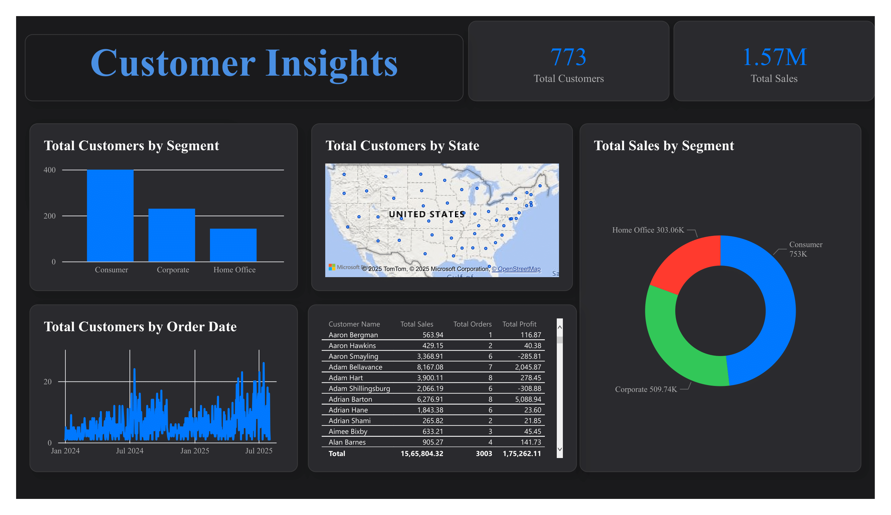

# 📊 Power BI SuperStore Sales Analytics Dashboard

[](https://github.com/Pragadees15/powerbi-superstore-analytics)

**Repository:** [powerbi-superstore-analytics](https://github.com/Pragadees15/powerbi-superstore-analytics)

**Description:** A comprehensive Power BI analytics solution for analyzing SuperStore sales data with interactive dashboards, customer insights, payment behavior analysis, and machine learning predictions. Features multiple themed dashboards including a dark-themed version for enhanced visualization experience.



## 📊 Overview

This project provides a complete business intelligence solution for analyzing retail sales data. It includes multiple interactive dashboards that offer insights into sales performance, customer behavior, payment patterns, and predictive analytics using machine learning.

## ✨ Features

### 📈 **Sales & Performance Dashboard**
- Total Sales, Profit, and Quantity metrics
- Sales trends and monthly analysis
- Segment-wise performance breakdown
- Profit margin analysis
- Order tracking and sales per order metrics



### 👥 **Customer Insights Dashboard**
- Customer count and retention metrics
- Customer lifetime value analysis
- Geographic customer distribution
- Segment analysis
- Top customers identification
- Customer trend visualization



### 💳 **Payment Behavior Dashboard**
- Payment mode distribution (Donut charts, Treemaps)
- Payment trends over time
- Payment mode vs. profit analysis
- Segment-wise payment behavior
- Online vs. offline payment insights



### 🤖 **ML Predictions Dashboard**
- Sales forecasting using machine learning
- Python-based predictive analytics
- Segment sales predictions
- Future trend analysis
- Interactive date slicers for scenario planning



## 🗂️ Project Structure

```
PowerBi Test/
│
├── dashboard_images/          # Dashboard screenshots
│   ├── Powerbi-1.png
│   ├── Powerbi-2.png
│   ├── Powerbi-3.png
│   ├── Powerbi-4.png
│   └── Powerbi-5.png
│
├── p.pbip                     # Power BI Project file
│
├── Improved Dashboard Updated Dark themed.pbix  # Alternative dark-themed dashboard
│
├── p.Report/                  # Report definitions
│   └── definition/
│       ├── pages/             # Dashboard pages
│       │   ├── customer_insights/
│       │   ├── ml_predictions/
│       │   └── payment_behavior/
│       └── report.json
│
├── p.SemanticModel/           # Data model definitions
│   └── definition/
│       ├── tables/
│       │   └── SuperStore_Sales_UpdatedDates.tmdl
│       └── model.tmdl
│
├── SuperStore_Sales_UpdatedDates.csv  # Source data
├── requirements.txt           # Python dependencies
└── README.md                  # This file
```

## 📋 Dataset Information

The **SuperStore Sales** dataset contains comprehensive retail sales information including:

- **Order Information**: Order ID, Order Date, Ship Date, Ship Mode
- **Customer Data**: Customer ID, Customer Name, Segment
- **Geographic Data**: Country, State, City, Region
- **Product Details**: Product ID, Product Name, Category, Sub-Category
- **Financial Metrics**: Sales, Profit, Quantity, Returns
- **Payment Information**: Payment Mode

### Key Metrics Calculated

- Total Sales
- Total Profit
- Profit Margin
- Total Orders
- Sales per Order
- Total Customers
- Average Shipping Time

## 🚀 Getting Started

### Prerequisites

- **Power BI Desktop** (latest version recommended)
- **Python 3.7+** (for ML predictions)
- Required Python packages (see `requirements.txt`)

### Installation

1. **Clone the repository**
   ```bash
   git clone https://github.com/Pragadees15/powerbi-superstore-analytics.git
   cd powerbi-superstore-analytics
   ```

2. **Install Python dependencies**
   ```bash
   pip install -r requirements.txt
   ```

3. **Open the Power BI project**
   - Open `p.pbip` file in Power BI Desktop
   - Alternatively, you can open `Improved Dashboard Updated Dark themed.pbix` for a dark-themed dashboard version
   - Ensure the data source path is correctly configured
   - Refresh the data model if needed

### Python Dependencies

The project uses the following Python libraries for data analysis and ML predictions:

- `pandas>=1.5.0` - Data manipulation
- `matplotlib>=3.5.0` - Data visualization
- `seaborn>=0.11.0` - Statistical visualization
- `numpy>=1.21.0` - Numerical computing
- `scikit-learn>=1.1.0` - Machine learning algorithms

## 📱 Dashboard Pages

### 1. Main Sales Dashboard
Comprehensive overview of sales performance with key metrics, trends, and segment analysis.

### 2. Customer Insights
Deep dive into customer behavior, retention, lifetime value, and geographic distribution.

### 3. Payment Behavior
Analysis of payment patterns, modes, and their impact on sales and profitability.

### 4. ML Predictions
Machine learning-powered sales forecasting and trend predictions for future planning.

## 🎨 Design Features

- **Modern Theme**: Apple Modern theme with clean, professional design
- **Interactive Visualizations**: Cross-filtering and drill-down capabilities
- **Responsive Layout**: Optimized for different screen sizes
- **Custom Visuals**: Tailored visualizations for specific business needs

## 📊 Key Visualizations

- **KPI Cards**: Total Sales, Profit, Orders, Customers
- **Trend Charts**: Monthly sales trends and customer growth
- **Geographic Maps**: Regional sales distribution
- **Segment Analysis**: Bar charts, pie charts, and treemaps
- **Forecast Charts**: ML-based predictive visualizations
- **Payment Analysis**: Donut charts and pivot tables

## 🔧 Customization

### Updating Data Source

1. Replace `SuperStore_Sales_UpdatedDates.csv` with your updated dataset
2. Ensure column names and structure match the existing model
3. Refresh the data model in Power BI Desktop

### Modifying Dashboards

- Edit visualizations directly in Power BI Desktop
- Add new measures in the Data Model
- Create additional pages for new insights
- Customize themes in the report settings

## 📈 Use Cases

- **Sales Performance Monitoring**: Track sales, profit, and order metrics
- **Customer Segmentation**: Identify high-value customers and segments
- **Payment Strategy**: Analyze payment preferences and optimize payment options
- **Forecasting**: Predict future sales trends for planning
- **Geographic Analysis**: Understand regional performance differences

## 🤝 Contributing

Contributions are welcome! Please feel free to submit a Pull Request to the [repository](https://github.com/Pragadees15/powerbi-superstore-analytics).

## 📝 License

This project is open source and available for educational and commercial use.

## 👤 Author

Created for comprehensive SuperStore sales analytics and business intelligence.

## 🔗 Related Resources

- [Power BI Documentation](https://docs.microsoft.com/power-bi/)
- [DAX Guide](https://dax.guide/)
- [Power BI Community](https://community.powerbi.com/)

---

**Note**: Make sure to update the data source path in the Power BI model if you're using this project in a different environment.

